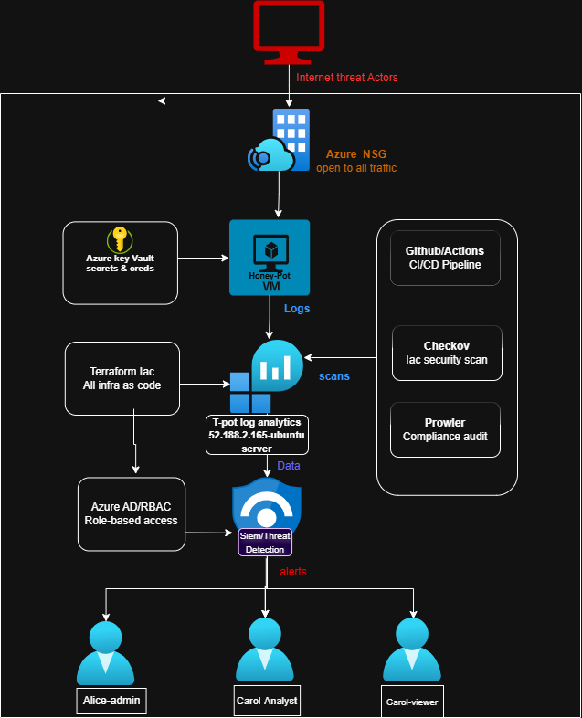

# Azure HoneyPot Cloud Security

**Author:** sbutech101  
**Certification:** Microsoft AZ-500 (Azure Security Engineer Associate)  
**Status:** Active - Live HoneyPot running at 52.188.2.165

---

## Project Overview

This project deploys a **deliberately vulnerable HoneyPot virtual machine** on Microsoft Azure, exposes it to real internet threat actors, and captures all attack data into **Microsoft Sentinel** for analysis by a simulated SOC team.

The goal is to demonstrate a real-world security operations workflow - from infrastructure deployment to threat detection and incident response - using industry-standard tools and best practices.

---

## What Was Achieved

- Deployed a live HoneyPot VM exposed to real internet attacks
- Captured real threat actor activity via Microsoft Sentinel SIEM
-  Built a SOC team structure with proper RBAC roles (Admin, Analyst, Viewer)
- Secured all infrastructure secrets using Azure Key Vault
- Identified and documented security vulnerabilities using Checkov
- Generated compliance report using Prowler
- Built an automated DevSecOps pipeline using GitHub Actions
- Demonstrated a real-world SOC analyst workflow end to end

---

##Architecture

[](diagram.png)

Technologies Used

| Technology | Purpose |
|---|---|
| **Azure VM (Ubuntu 24.04)** | HoneyPot target machine |
| **Azure NSG** | Intentionally open rules to attract attackers |
| **Microsoft Sentinel** | SIEM — captures and analyses attack data |
| **Log Analytics Workspace** | Feeds logs from VM into Sentinel |
| **Azure Active Directory** | SOC team user management |
| **Azure RBAC** | Role-based access control for SOC team |
| **Azure Key Vault** | Secure secret and credential management |
| **Terraform** | Infrastructure as Code — all resources deployed via code |
| **Checkov** | Static security scanning of Terraform code |
| **Prowler** | Azure compliance and security reporting |
| **GitHub Actions** | Automated CI/CD security pipeline |

---

SOC Team Structure

| User | Role | Sentinel Access | Responsibility |
|---|---|---|---|
| **Alice Admin** | Security Administrator | Sentinel Contributor | Manages HoneyPot infrastructure and Sentinel |
| **Bob Analyst** | SOC Analyst | Sentinel Responder | Investigates alerts and attack patterns |
| **Carol Viewer** | Compliance Auditor | Sentinel Reader | Reviews dashboards and compliance reports |

---

##Project Structure

```
CloudSecurity/
├── tpot/
│   ├── main.tf                    # HoneyPot VM, NSG, networking
│   └── az500-honeypot-team.tf     # SOC users, groups, RBAC roles
├── .github/
│   └── workflows/
│       └── checkov.yml            # Automated security scanning pipeline
├── .gitignore                     # Protects sensitive files from GitHub
├── Part 1 - Setting Up HoneyPot.md
├── Part 2 - Infrastructure as Code.md
├── Part 3 - Terraform.md
├── Part 4 - Deploying HoneyPot.md
├── Part 5 - Checkov Security Scan.md
├── Part 6 - Prowler Compliance Report.md
├── Part 7 - Azure Sentinel Integration.md
├── Part 8 - Key Vault Secret Management.md
└── Part 9 - GitHub Actions CI/CD Pipeline.md
```

---

Security Design Decisions

### Why is the NSG open to all traffic?
This is intentional. A HoneyPot works by **attracting attackers** — if we locked down the NSG, threat actors would never connect and we would have no data to analyse. The open NSG rules are a deliberate security design choice, not a mistake.

Why are two Checkov checks skipped?
| Check | Reason Skipped |
|---|---|
| `CKV_AZURE_160` — HTTP port 80 restricted | Intentionally open — HoneyPot design |
| `CKV2_AZURE_10` — Microsoft Antimalware | Windows-only feature — VM runs Linux Ubuntu |

Why Azure Key Vault?
All secrets (VM passwords, subscription IDs, user credentials) are stored in Azure Key Vault and referenced in Terraform via `data` blocks. No passwords are hardcoded in any `.tf` files.

---

How to Deploy

### Prerequisites
- Azure subscription
- Terraform installed
- Azure CLI installed
- tpot-keyvault created with these secrets:
  - `vm-admin-password`
  - `subscription-id`
  - `alice-password`
  - `bob-password`
  - `carol-password`

Steps
```bash
# 1. Clone the repo
git clone https://github.com/sbuTech101/CloudSecurity.git
cd CloudSecurity/tpot

# 2. Set Azure credentials
export ARM_CLIENT_ID="..."
export ARM_CLIENT_SECRET="..."
export ARM_TENANT_ID="..."
export ARM_SUBSCRIPTION_ID="..."

# 3. Initialise Terraform
terraform init

# 4. Preview changes
terraform plan

# 5. Deploy
terraform apply
```

---

CI/CD Pipeline

Every time code is pushed to GitHub, the pipeline automatically:

1. Checks out the code
2. Installs Checkov
3. Scans all Terraform files for security issues
4. Skips known intentional findings (HoneyPot NSG rules)
5. Uploads scan results as a downloadable report

```
git push → GitHub Actions triggers → Checkov scans → ✅ Pass or ❌ Fail
```

---

Checkov Scan Results

| Result | Count |
|---|---|
| ✅ Passed | 27 |
| ❌ Failed | 29 |
| ⏭️ Skipped (intentional) | 2 |

Key Findings Fixed:
| Finding | Fix Applied |
|---|---|
| Hardcoded VM password `CyberNOW!` | Moved to Azure Key Vault |
| Hardcoded subscription ID | Moved to Azure Key Vault |
| Hardcoded user passwords (Alice, Bob, Carol) | Moved to Azure Key Vault |

---

Prowler Compliance Report

Prowler was used to generate a full Azure compliance report against:
- CIS Azure Benchmark 2.0
- CIS Azure Benchmark 2.1
- CIS Azure Benchmark 3.0
- MITRE ATT&CK Framework
- ENS RD2022

Full report available in `/output/` folder.

---

Lessons Learned

1. **Conditional Access requires Azure AD Premium P1** — free tier tenants cannot use Conditional Access policies. Security Defaults were used as a free alternative covering MFA and legacy auth blocking.

2. **Hardcoded secrets are a critical risk** — even in lab environments, hardcoded passwords in Terraform files are flagged by Checkov and pose a real risk if pushed to public GitHub repos. Key Vault integration solves this.

3. **Terraform state files contain sensitive data** — `terraform.tfstate` stores resource IDs and configuration details. It must never be pushed to GitHub — always use `.gitignore` or remote state storage.

4. **HoneyPots attract attacks fast** — a VM exposed to the internet at port 22 (SSH) begins receiving brute force login attempts within minutes of deployment.

5. **DevSecOps is about shifting security left** — by running Checkov automatically on every push, security issues are caught before they reach production rather than after.

---

## 🔗 Connect

- **GitHub:** github.com/sbuTech101
- **Certification:** Microsoft AZ-500 Azure Security Engineer Associate
